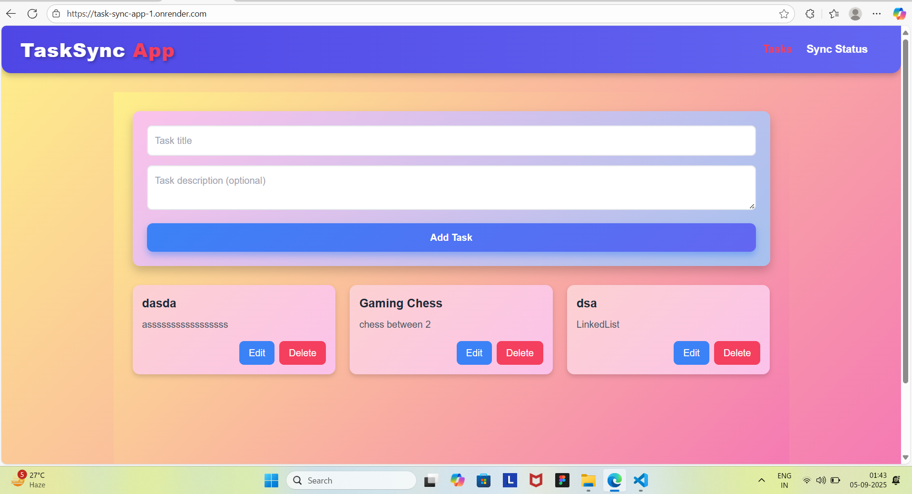
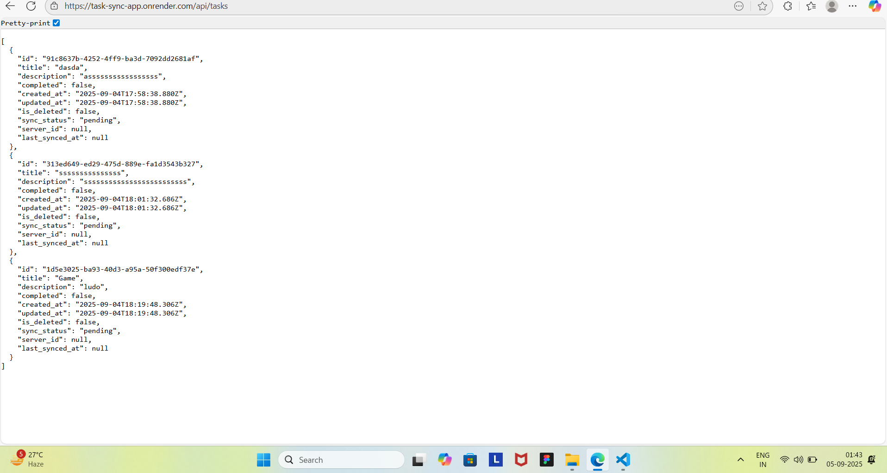
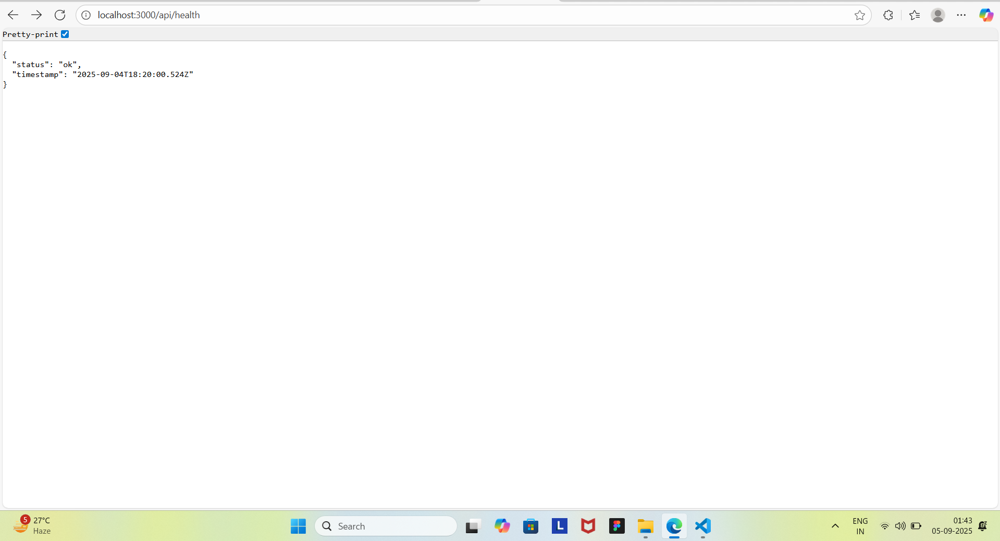
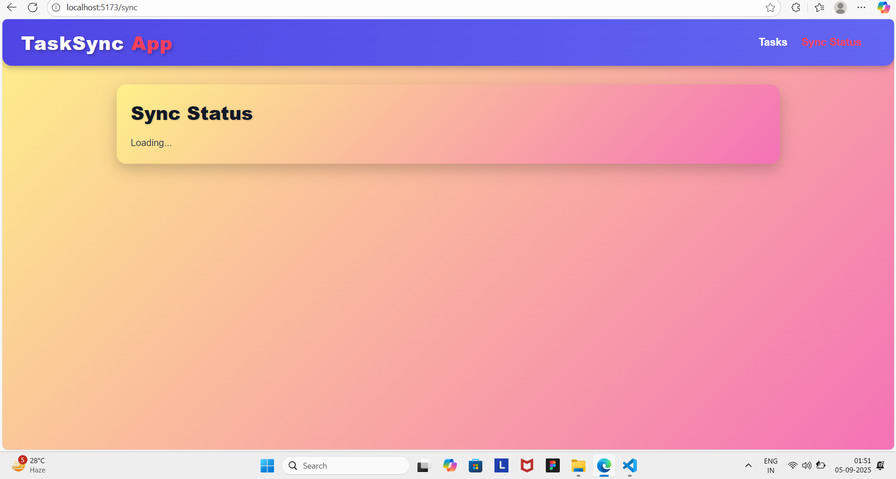

# 🌟 TaskSync App

A **Sync-Enabled Task Management Application** built with **React**, **Tailwind CSS**, and **TypeScript** for the frontend, and **Node.js**, **Express**, **SQLite**, and **TypeScript** for the backend.  
This app supports **offline-first functionality**, **real-time syncing**, and **conflict resolution** for tasks.  

---

## 🚀 Features

- ✅ **Create, Read, Update, Delete (CRUD)** tasks  
- 🔄 **Offline-first task syncing**  
- ⚡ **Conflict resolution** for concurrent edits  
- 🌐 **Sync Status Dashboard**  
- 🎨 **Bright and attractive UI** with Tailwind CSS  
- 🔧 **API-first design** for extensibility  

---


## 🚀 Deployment

The project is live on Render:

- **Backend API:** [https://task-sync-app.onrender.com/api/tasks](https://task-sync-app.onrender.com/api/tasks)  
- **Frontend App:** [https://task-sync-app-1.onrender.com](https://task-sync-app-1.onrender.com)  

You can use the frontend to interact with the backend API for creating, editing, deleting, and syncing tasks in real-time. 🌟

---

## 🛠️ Tech Stack

### Frontend
- React + TypeScript  
- Tailwind CSS  
- React Router v6  

### Backend
- Node.js + Express + TypeScript  
- SQLite database  
- REST API for task management and syncing  

---

## 📁 Project Structure

```

task-sync-app/
├── backend/                         # Backend API
│   ├── src/
│   │   ├── db/                      # Database setup
│   │   ├── models/                  # Data models
│   │   ├── services/                # Business logic
│   │   ├── routes/                  # API endpoints
│   │   ├── middleware/              # Middlewares
│   │   ├── types/                   # TypeScript interfaces
│   │   └── server.ts                # Express app
│   ├── package.json
│   ├── tsconfig.json
│   └── .env
├── frontend/                        # React + Tailwind UI
│   ├── src/
│   │   ├── components/
│   │   ├── pages/
│   │   ├── App.tsx
│   │   ├── main.tsx
│   │   └── index.css
│   ├── package.json
│   └── tailwind.config.js
└── README.md

````

---

## 📸 Screenshots

### First: Task List


### Second: Sync Status


### Third: Add Task


### Fourth: (Optional / Another Screenshot)



---

## 🏗️ Challenges & Solutions

While building this project, I faced some interesting challenges:

1. **Offline-first Sync Logic** ⚡  
   **Challenge:** Ensuring tasks could be created and edited offline and then synced without data loss.  
   **Solution:** Implemented a **sync queue** with conflict resolution, so changes are applied safely when online.

2. **Conflict Resolution** 🔄  
   **Challenge:** What if two users edit the same task before syncing?  
   **Solution:** Adopted a **last-write-wins** strategy with timestamps, showing the latest update as the source of truth.

3. **UI Styling** 🎨  
   **Challenge:** Making the interface **bright, modern, and responsive** while using Tailwind.  
   **Solution:** Used **inline styles for TaskCard hover effects**, gradient navbar, and accent colors for buttons to make UI visually appealing.

4. **TypeScript & Type Safety** 📌  
   **Challenge:** Managing proper types for API responses, tasks, and sync status.  
   **Solution:** Defined **interfaces** for all objects and strictly typed API requests/responses to avoid runtime errors.

---

## ⚡ Getting Started

### Backend
```bash
cd backend
npm install
cp .env.example .env
npm run dev
````

API will run at: `http://localhost:3000`

### Frontend

```bash
cd frontend
npm install
npm run dev
```

Frontend will run at: `http://localhost:5173` (or as displayed in terminal)

---

## 🔗 API Endpoints

### Tasks

* `GET /api/tasks` - Fetch all tasks
* `POST /api/tasks` - Create a task
* `PUT /api/tasks/:id` - Update a task
* `DELETE /api/tasks/:id` - Delete a task

### Sync

* `GET /api/sync` - Check sync status
* `POST /api/sync` - Trigger sync

---

## 🎨 UI Highlights

* Task Dashboard with hover effects
* Task Card animations and accent colors
* Sync Status Page with real-time updates


---

## 👨‍💻 Author

**Sarad Agarwal**

* GitHub: [Sarad-Agarwal](https://github.com/Sarad-Agarwal)

---
